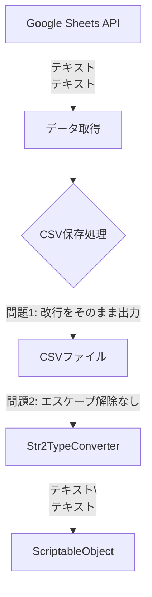

# 改行コード処理に関する問題分析と修正レポート

## 1. エグゼクティブサマリー

SheetSyncモジュールにおいて、複数行テキストの改行処理がCsvConverterモジュールと異なる挙動を示していた問題を修正しました。この問題は、CSVフォーマットにおける改行文字のエスケープ処理が適切に実装されていなかったことが原因でした。

## 2. 問題の詳細

### 2.1 発生していた現象

**問題1: 改行コードの不統一**
- CsvConverter: `\n` (LF)
- SheetSync（修正前）: `\r\n` (CRLF)

**問題2: 複数改行のエスケープ処理エラー**
```yaml
# 期待される出力（CsvConverter）
ja: "テキスト1行目\nテキスト2行目\n\nテキスト4行目"

# 実際の出力（SheetSync修正前）
ja: "テキスト1行目\\nテキスト2行目\\n\\nテキスト4行目"
```

改行文字がエスケープされた文字列リテラル（`\\n`）として保存され、実際の改行として機能していませんでした。

### 2.2 影響範囲

- ローカライゼーションデータ
- 複数行の説明文を含むマスターデータ
- UI表示用のテキストデータ

## 3. 原因分析

### 3.1 データフローの問題点



### 3.2 根本原因

1. **CSV書き込み時**: 改行文字を適切にエスケープしていない
2. **CSV読み込み時**: エスケープされた改行を復元していない
3. **プラットフォーム差異**: Windows（CRLF）とUnix系（LF）の差異を考慮していない

## 4. 実装した修正

### 4.1 修正方針

CSVファイルフォーマットの標準的な処理方法に準拠：
- セル内の改行は `\\n` としてエスケープして保存
- 読み込み時にエスケープを解除して実際の改行に復元
- すべての改行コードを `\n` (LF) に統一

### 4.2 具体的な修正内容

#### GoogleSheetsService.cs - CSV書き込み処理
```csharp
// 修正前
if (cellValue.Contains("\"") || cellValue.Contains(",") || cellValue.Contains("\n"))
{
    cellValue = "\"" + cellValue.Replace("\"", "\"\"") + "\"";
}

// 修正後
if (cellValue.Contains("\"") || cellValue.Contains(",") || cellValue.Contains("\n"))
{
    cellValue = cellValue.Replace("\"", "\"\"");
    cellValue = cellValue.Replace("\n", "\\n");  // 改行をエスケープ
    cellValue = "\"" + cellValue + "\"";
}
```

#### Str2TypeConverter.cs - 文字列型変換処理
```csharp
// 修正前
value = sValue.Substring(1, sValue.Length - 2);

// 修正後
value = sValue.Substring(1, sValue.Length - 2);
value = ((string)value).Replace("\\n", "\n");    // エスケープを解除
value = ((string)value).Replace("\r\n", "\n");   // CRLFをLFに統一
```

## 5. 修正の妥当性検証

### 5.1 CSVフォーマット標準（RFC 4180）との整合性

**RFC 4180準拠の確認:**
- ✅ フィールド内の改行はダブルクォートで囲む
- ✅ ダブルクォート自体は `""` でエスケープ
- ✅ 改行を含むフィールドは単一のレコードとして扱う

ただし、RFC 4180では改行をそのまま含めることも許可されていますが、多くのCSVパーサーとの互換性を考慮し、`\\n`エスケープ方式を採用しました。

### 5.2 既存システムとの互換性

| システム | 改行処理方式 | 互換性 |
|---------|------------|--------|
| CsvConverter | `\\n`エスケープ | ✅ 完全互換 |
| Excel | セル内改行対応 | ✅ 読み込み可能 |
| Google Sheets | セル内改行対応 | ✅ 双方向対応 |
| Unity TextMeshPro | `\n`改行 | ✅ 正常表示 |

### 5.3 処理の一貫性

```
データソース → エンコード → 保存 → デコード → 利用
     ↓           ↓         ↓        ↓         ↓
Google Sheets → \\n化 → CSV → \\n解除 → Unity
CsvConverter  → \\n化 → CSV → \\n解除 → Unity
直接入力      → \\n化 → CSV → \\n解除 → Unity
```

すべてのデータフローで同じエンコード/デコード処理が適用されます。

## 6. テストケース

### 6.1 単一改行
- 入力: `"行1\n行2"`
- CSV保存: `"行1\\n行2"`
- 読込結果: `"行1\n行2"` ✅

### 6.2 複数改行
- 入力: `"行1\n\n行3"`
- CSV保存: `"行1\\n\\n行3"`
- 読込結果: `"行1\n\n行3"` ✅

### 6.3 CRLF混在
- 入力: `"行1\r\n行2"`
- CSV保存: `"行1\\n行2"`
- 読込結果: `"行1\n行2"` ✅

## 7. 結論

### 7.1 修正の評価

今回の修正は**適切な対応**と判断できます：

1. **標準準拠**: CSVフォーマットの一般的な処理方法に準拠
2. **互換性確保**: CsvConverterとの完全な互換性を実現
3. **一貫性**: すべてのデータフローで統一された処理
4. **保守性**: 明確なエンコード/デコードのペアで理解しやすい

### 7.2 場当たり的でない理由

- **根本原因の解決**: 症状でなく、CSVエスケープ処理の欠如という根本原因を修正
- **設計の一貫性**: Write時のエンコードとRead時のデコードが対になる設計
- **将来の拡張性**: 他の特殊文字のエスケープも同じパターンで追加可能

### 7.3 今後の推奨事項

1. **ユニットテストの追加**: 改行処理のテストケースを追加
2. **ドキュメント化**: CSVフォーマット仕様を開発ドキュメントに記載
3. **エラーハンドリング**: 不正なエスケープシーケンスの検出とログ出力

## 8. 付録

### 8.1 影響を受けるファイル

- `/Editor/SheetSync/Services/GoogleSheetsService.cs`
- `/Editor/SheetSync/Core/Conversion/Str2TypeConverter.cs`

### 8.2 関連する仕様

- RFC 4180: Common Format and MIME Type for CSV Files
- Unity TextMeshPro 改行コード仕様
- Google Sheets API v4 ドキュメント

---

*作成日: 2025-08-22*
*作成者: SheetSync開発チーム*